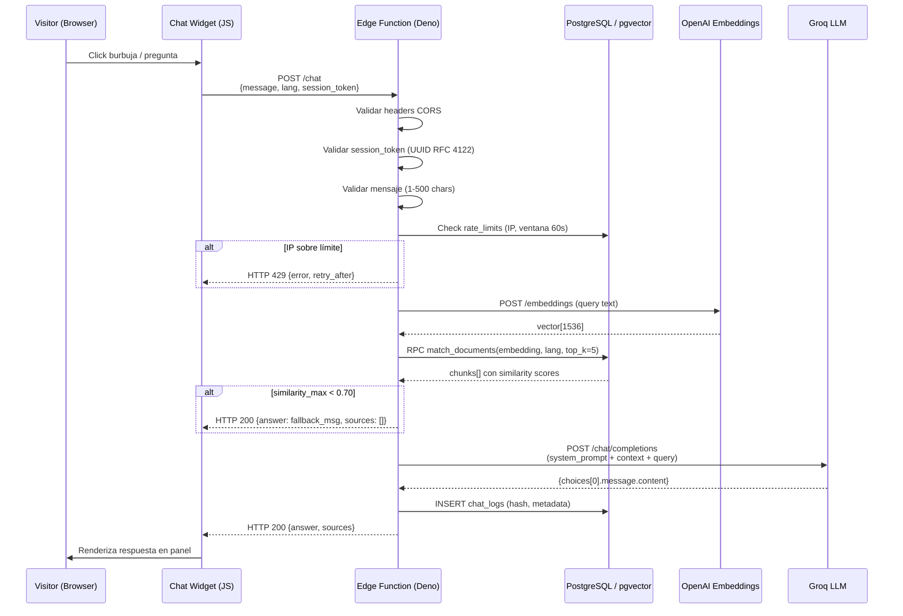
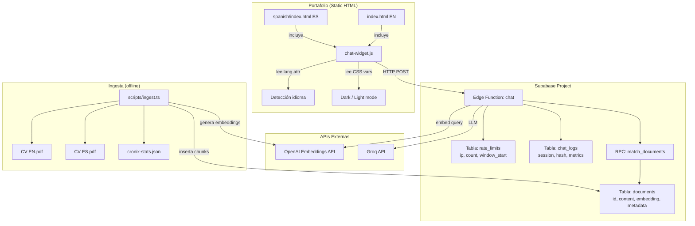

# Documento de Diseño: portfolio-conversational-agent

## Overview

El agente conversacional del portafolio es un sistema RAG (Retrieval-Augmented Generation) embebido en producción que permite a reclutadores y visitantes hacer preguntas en lenguaje natural sobre Luis Romero. El sistema tiene dos capas principales:

1. **Frontend (Chat Widget)**: componente vanilla HTML/CSS/JS que se integra en ambas versiones del portafolio (`/index.html` y `/spanish/index.html`) como burbuja flotante en la esquina inferior derecha.
2. **Backend (Edge Function RAG)**: función serverless Deno/TypeScript desplegada en Supabase que orquesta el pipeline completo: generación de embedding de la consulta → búsqueda vectorial en pgvector → construcción del prompt → inferencia en Groq (`llama3-70b-8192`) → respuesta JSON.

El propósito del sistema es doble: servir información contextual sobre Luis y demostrar exactamente el stack que él sabe construir (Supabase + Groq + pgvector).

### Stack Tecnológico

| Capa | Tecnología |
|------|-----------|
| Frontend | HTML/CSS/JS vanilla (sin frameworks) |
| Widget CSS | Variables CSS del portafolio existente (`--accent`, `--bg-*`, `--text-*`) |
| Backend | Supabase Edge Function (Deno / TypeScript) |
| Vector DB | PostgreSQL + pgvector (extensión `vector`) en Supabase |
| Embeddings | `text-embedding-ada-002` vía API de OpenAI (1536 dimensiones) |
| LLM | Groq `llama3-70b-8192`, temperatura 0.3, max_tokens 512 |
| Rate Limiting | Tabla `rate_limits` en PostgreSQL |
| Logging | Tabla `chat_logs` en PostgreSQL |
| Ingesta | Script Deno standalone (`scripts/ingest.ts`) |

---

## Architecture

### Diagrama de flujo principal



### Diagrama de componentes



---

## Components and Interfaces

### 1. Chat Widget (`assets/js/chat-widget.js`)

Archivo JS vanilla que se añade a ambas páginas HTML con un `<script>` antes de `</body>`. No depende de ningún framework ni npm package.

**Responsabilidades:**
- Renderizar el botón burbuja y el panel de conversación mediante DOM API
- Generar y persistir el `session_token` (UUID v4) en `sessionStorage`
- Detectar el idioma (`document.documentElement.lang`) en cada envío
- Gestionar el historial de mensajes en memoria (máx. 20 visibles)
- Implementar retry exponencial (1 s, 2 s, máx. 2 reintentos)
- Manejar todos los estados de error con mensajes localizados

**Interfaz pública (módulo IIFE):**
```typescript
// API interna del widget (no expuesta globalmente salvo init)
interface ChatWidget {
  init(): void                          // auto-llamado al cargar el script
  toggle(): void                        // abrir/cerrar panel
  sendMessage(text: string): Promise<void>
}
```

**Estados del Widget:**
```
CLOSED ──click──> OPEN
OPEN ──click_outside / Escape──> CLOSED
OPEN ──send──> LOADING ──response──> OPEN
LOADING ──error──> ERROR_STATE ──retry──> LOADING
ERROR_STATE ──max_retries──> OPEN (con mensaje fallback)
```

### 2. Edge Function (`supabase/functions/chat/index.ts`)

Función Deno TypeScript que maneja `POST /functions/v1/chat`.

**Firma del endpoint:**
```
POST /functions/v1/chat
Headers:
  Content-Type: application/json
  X-Session-Token: <UUID v4>
  X-Real-IP: <IP> (inyectada por Supabase gateway)

Body:
{
  "message": string,   // 1-500 chars
  "lang": "es" | "en"  // default "en"
}

Response 200:
{
  "answer": string,
  "sources": string[]  // nombres de archivos fuente
}

Response 400: { "error": "invalid_session_token" }
Response 422: { "error": "invalid_message", "max_length": 500 }
Response 429: { "error": "rate_limit_exceeded", "retry_after": number }
Response 403: CORS - origen no permitido
Response 500: { "error": "internal_error" }
```

**Pipeline interno de la Edge Function:**
```
1. CORS preflight (OPTIONS) → responder con headers permitidos
2. Validar Origin → 403 si no permitido
3. Parsear body → 422 si message inválido
4. Validar X-Session-Token → 400 si malformado
5. Verificar rate_limits → 429 si excedido
6. Generar embedding del message vía OpenAI
7. RPC match_documents(embedding, lang, 5)
8. Si max(similarity) < 0.70 → respuesta fuera-de-contexto
9. Construir system prompt con chunks recuperados
10. Llamar Groq API (llama3-70b-8192, temp=0.3, max_tokens=512)
11. INSERT chat_logs (async, no bloquea respuesta)
12. Retornar { answer, sources }
```

### 3. Función SQL `match_documents`

```sql
CREATE OR REPLACE FUNCTION match_documents(
  query_embedding  vector(1536),
  query_lang       text,
  match_count      int DEFAULT 5
)
RETURNS TABLE (
  id          bigint,
  content     text,
  source      text,
  lang        text,
  similarity  float
)
LANGUAGE plpgsql
AS $$
BEGIN
  RETURN QUERY
  SELECT
    d.id,
    d.content,
    (d.metadata->>'source')::text  AS source,
    (d.metadata->>'lang')::text    AS lang,
    1 - (d.embedding <=> query_embedding) AS similarity
  FROM documents d
  ORDER BY
    -- Priorizar mismo idioma, luego por similaridad
    CASE WHEN (d.metadata->>'lang') = query_lang THEN 0 ELSE 1 END,
    d.embedding <=> query_embedding
  LIMIT match_count;
END;
$$;
```

### 4. Script de Ingesta (`scripts/ingest.ts`)

Script Deno standalone (no Edge Function) ejecutado manualmente o en CI.

**Responsabilidades:**
- Leer y extraer texto de los PDFs (usando `unpdf` vía CDN de `esm.sh`)
- Leer y serializar `cronix-stats.json`
- Dividir texto en chunks (200-500 tokens, 50 tokens de solapamiento)
- Generar embeddings en lotes de 20 vía OpenAI API
- Upsert en tabla `documents` con metadatos

**Interfaz de ejecución:**
```bash
deno run --allow-read --allow-net --allow-env scripts/ingest.ts
```

---

## Data Models

### Tabla `documents` (Vector Store)

```sql
CREATE TABLE documents (
  id          bigserial PRIMARY KEY,
  content     text        NOT NULL,
  embedding   vector(1536) NOT NULL,
  metadata    jsonb        NOT NULL DEFAULT '{}',
  created_at  timestamptz  NOT NULL DEFAULT now()
);

-- Índice HNSW para búsqueda coseno (reemplaza IVFFlat para <100k vectores)
CREATE INDEX ON documents
  USING hnsw (embedding vector_cosine_ops)
  WITH (m = 16, ef_construction = 64);
```

**Estructura del campo `metadata`:**
```json
{
  "source": "LuisRomero_AIEngineer-Backend_2026_EN.pdf",
  "lang": "en",
  "chunk_index": 3,
  "created_at": "2026-01-01T00:00:00Z"
}
```

### Tabla `rate_limits`

```sql
CREATE TABLE rate_limits (
  ip           text        NOT NULL,
  count        int         NOT NULL DEFAULT 1,
  window_start timestamptz NOT NULL DEFAULT now(),
  PRIMARY KEY (ip)
);
```

La lógica de ventana deslizante se implementa en la Edge Function: si `now() - window_start > 60s`, se resetea `count = 1` y `window_start = now()`; de lo contrario, se incrementa `count`. Si `count > 10`, se retorna 429.

**Campo `retry_after`**: calculado como `60 - EXTRACT(EPOCH FROM (now() - window_start))`.

### Tabla `chat_logs`

```sql
CREATE TABLE chat_logs (
  id               bigserial    PRIMARY KEY,
  session_token    uuid         NOT NULL,
  lang             text         NOT NULL CHECK (lang IN ('es', 'en')),
  message_hash     text         NOT NULL,  -- SHA-256 hex del mensaje
  chunks_retrieved int          NOT NULL,
  response_time_ms int          NOT NULL,
  created_at       timestamptz  NOT NULL DEFAULT now()
);

-- RLS: solo la service role puede insertar; nadie puede leer desde cliente
ALTER TABLE chat_logs ENABLE ROW LEVEL SECURITY;
CREATE POLICY "service_role_insert_only" ON chat_logs
  FOR INSERT
  TO service_role
  WITH CHECK (true);
```

### Tabla `documents` — RLS

```sql
ALTER TABLE documents ENABLE ROW LEVEL SECURITY;
-- Lectura pública (la Edge Function usa anon key para RPC)
CREATE POLICY "public_read" ON documents
  FOR SELECT USING (true);
-- Solo service_role puede insertar (script de ingesta)
CREATE POLICY "service_role_insert" ON documents
  FOR INSERT TO service_role WITH CHECK (true);
```

### Esquema de mensajes del Chat Widget

```typescript
interface ChatMessage {
  id:        string;         // UUID v4 generado en cliente
  role:      'user' | 'assistant' | 'system';
  content:   string;
  timestamp: number;         // Date.now()
  error?:    boolean;        // true si es mensaje de error/fallback
}

interface ChatSession {
  sessionToken:  string;     // UUID v4 persistido en sessionStorage
  messages:      ChatMessage[];
  lang:          'es' | 'en';
  isOpen:        boolean;
  isLoading:     boolean;
  retryCount:    number;
  rateLimitUntil?: number;   // timestamp hasta el que deshabilitar input
}
```

### Esquema de request/response de la Edge Function

```typescript
// Request body
interface ChatRequest {
  message: string;   // 1-500 chars
  lang:    'es' | 'en';
}

// Response exitosa
interface ChatResponse {
  answer:  string;
  sources: string[];  // ej: ["LuisRomero_AIEngineer-Backend_2026_EN.pdf"]
}

// Response de error
interface ErrorResponse {
  error:        string;
  retry_after?: number;  // solo en 429
  max_length?:  number;  // solo en 422
}
```

---

## Correctness Properties

*Una propiedad es una característica o comportamiento que debe ser verdadero en todas las ejecuciones válidas del sistema — esencialmente, un enunciado formal sobre lo que el sistema debe hacer. Las propiedades sirven como puente entre especificaciones legibles por humanos y garantías de corrección verificables automáticamente.*

---

### Property 1: Validación de mensajes rechaza entradas fuera de rango

*Para todo* string enviado como `message` con longitud 0 o > 500 caracteres, o para cualquier request donde el campo `message` esté ausente del body, la Edge Function DEBE retornar HTTP 422 con `error: "invalid_message"` sin invocar la API de embeddings ni la API de Groq, independientemente del valor de los demás campos de la petición.

**Valida: Requisito 4.4**

---

### Property 2: Rate limiting bloquea la petición número 11 en adelante por IP

*Para todo* conjunto de peticiones válidas enviadas desde la misma IP donde el conteo acumulado en la ventana deslizante de 60 segundos supera 10, la Edge Function DEBE retornar HTTP 429 con `error: "rate_limit_exceeded"` y un campo `retry_after` con un valor positivo (en segundos), sin ejecutar el pipeline RAG. Para peticiones cuyo conteo es ≤ 10, la Edge Function NO DEBE retornar 429.

**Valida: Requisitos 4.1, 4.2**

---

### Property 3: Session token inválido rechazado en todo caso

*Para toda* petición que carezca del header `X-Session-Token` o que contenga cualquier string que no sea un UUID v4 válido conforme a RFC 4122, la Edge Function DEBE retornar HTTP 400 con `error: "invalid_session_token"`, sin avanzar al pipeline RAG, independientemente del contenido válido del body.

**Valida: Requisito 4.3**

---

### Property 4: Threshold de similitud determina la invocación al LLM

*Para todo* mensaje procesado y cualquier conjunto de chunks recuperados del vector store: si la similitud coseno máxima entre los chunks y el embedding del mensaje es ≥ 0.70, la Edge Function DEBE invocar al LLM y retornar la respuesta generada; si ningún chunk alcanza similitud ≥ 0.70, la Edge Function DEBE retornar el mensaje de fallback de contexto con `sources: []` sin invocar al LLM en ningún caso.

**Valida: Requisitos 3.2, 3.3**

---

### Property 5: El system prompt siempre refleja el idioma de la petición

*Para todo* mensaje enviado con `lang: "es"`, el system prompt construido por la Edge Function DEBE contener instrucciones en español; *para todo* mensaje con `lang: "en"`, las instrucciones DEBEN ser en inglés; *para todo* valor de `lang` distinto de `"es"` y `"en"`, el comportamiento DEBE ser idéntico al de `lang: "en"`.

**Valida: Requisitos 6.1, 6.2, 6.4**

---

### Property 6: El system prompt siempre contiene las instrucciones de restricción sobre Luis Romero

*Para todo* mensaje enviado a la Edge Function, independientemente del contenido, el system prompt construido DEBE contener instrucciones que restrinjan al LLM a responder únicamente sobre Luis Romero usando el contexto provisto y que prohíban explícitamente inventar datos no presentes en los chunks recuperados.

**Valida: Requisito 3.4**

---

### Property 7: Privacidad del mensaje — solo hash SHA-256 almacenado

*Para todo* mensaje de texto procesado exitosamente por la Edge Function, el payload insertado en `chat_logs` DEBE contener el campo `message_hash` igual al SHA-256 hex del texto plano del mensaje, y el texto plano del mensaje NUNCA DEBE aparecer en ningún campo del payload de inserción.

**Valida: Requisito 8.2**

---

### Property 8: Round-trip de embeddings garantiza recuperabilidad de chunks

*Para todo* chunk de texto ingestado en el Vector Store, una búsqueda de similitud coseno ejecutada con el embedding de ese mismo chunk como query DEBE recuperar ese chunk como el resultado de mayor similitud (top-1) con una puntuación ≥ 0.99.

**Valida: Requisito 2.3**

---

### Property 9: El chunker genera segmentos dentro del rango de tokens requerido

*Para todo* texto de entrada procesado por el chunker del script de ingesta, todos los chunks generados DEBEN tener una longitud en tokens entre 200 y 500 inclusive, y cada par de chunks consecutivos DEBE compartir exactamente 50 tokens de solapamiento en su frontera.

**Valida: Requisito 2.1**

---

### Property 10: Preguntas sugeridas invisibles tras primer intercambio

*Para toda* sesión del Chat Widget en la que ya existe al menos 1 mensaje enviado por el usuario y al menos 1 respuesta del asistente, el componente de preguntas sugeridas NO DEBE estar presente ni ser visible en el DOM del panel de conversación.

**Valida: Requisito 7.5**

---

### Property 11: Retry exhausto antes de mostrar fallback definitivo

*Para todo* escenario en el que la Edge Function retorna HTTP ≥ 500 o la petición excede el timeout de 8 segundos, el Chat Widget DEBE ejecutar exactamente 2 reintentos adicionales (3 intentos en total, con esperas de ~1 s y ~2 s) antes de mostrar el mensaje de fallback definitivo. El fallback definitivo NO DEBE mostrarse después del primer intento fallido ni después del segundo; DEBE mostrarse únicamente si los 3 intentos han fallado.

**Valida: Requisitos 5.1, 5.4**

---

### Property 12: CORS rechaza cualquier origen no permitido

*Para todo* request con un header `Origin` que no corresponda al dominio de producción de Vercel del portafolio ni a `localhost` (con cualquier puerto), la Edge Function DEBE retornar HTTP 403 sin procesar el pipeline RAG, y el body de la respuesta DEBE estar vacío o indicar el error de origen.

**Valida: Requisito 4.5**

---

### Propiedad 13: El widget transmite el lang del documento en el momento exacto del envío

*Para todo* estado del atributo `lang` del elemento `<html>` en el momento en que el usuario presiona enviar, el campo `lang` incluido en el body de la petición a la Edge Function DEBE ser igual al valor leído de `document.documentElement.lang` en ese instante preciso, independientemente de cómo era ese valor en momentos anteriores de la sesión.

**Valida: Requisito 6.3**

---

## Error Handling

### Matriz de errores del backend

| Condición | HTTP | Body | Acción del widget |
|-----------|------|------|-------------------|
| Origin no permitido | 403 | `{error: "forbidden"}` | Mostrar fallback estático |
| Session token ausente/malformado | 400 | `{error: "invalid_session_token"}` | Log en console.error, mensaje de error sin propagar |
| Message inválido (vacío o >500) | 422 | `{error: "invalid_message", max_length: 500}` | Log en console.error, mensaje de error inline |
| Rate limit excedido | 429 | `{error: "rate_limit_exceeded", retry_after: N}` | Deshabilitar input por N segundos, mostrar countdown |
| Error interno (embedding/Groq falla) | 500 | `{error: "internal_error"}` | Retry exponencial (1s, 2s), luego fallback |
| Timeout cliente (>8s) | — | — | Abortar con AbortController, retry, luego fallback |
| Fallo de insert chat_logs | — | — | Log warn en Supabase, continuar con respuesta normal |

### Estrategia de retry del widget

```
intento 1 → error 5xx/timeout
  │
  ├─ esperar 1000ms
  │
intento 2 → error 5xx/timeout
  │
  ├─ esperar 2000ms
  │
intento 3 → error 5xx/timeout
  │
  └─ mostrar mensaje fallback definitivo (localizado)
```

### Degradación del script de ingesta

- Archivo PDF no encontrado → log de error + continuar con los demás
- Fallo en API de embeddings → retry 3 veces con backoff, luego skip del chunk + log
- Fallo en INSERT a Supabase → retry 2 veces, luego abort con resumen de errores

### Manejo de errores en la Edge Function

```typescript
// Patrón: try/catch global con respuesta segura
try {
  // pipeline completo
} catch (err) {
  // No exponer detalles internos al cliente
  console.error('[chat] Internal error:', err);
  return new Response(JSON.stringify({ error: 'internal_error' }), {
    status: 500,
    headers: corsHeaders
  });
}
```

### Fallo del insert en chat_logs (no bloquea respuesta)

```typescript
// Fire-and-forget con manejo de error no bloqueante
supabaseAdmin.from('chat_logs').insert(logEntry)
  .then(({ error }) => {
    if (error) console.warn('[chat] chat_logs insert failed:', error.message);
  });
```

---

## Testing Strategy

### Evaluación de PBT (Property-Based Testing)

Este feature contiene lógica de validación, transformación y enrutamiento en la Edge Function y en el Chat Widget, donde el comportamiento varía significativamente con el input. PBT es apropiado para:
- Validación de inputs (message length, UUID format, lang param)
- Lógica de rate limiting (ventana deslizante)
- Cálculos de similitud (threshold filtering)
- Privacidad de logs (message_hash)
- Lógica de retry del widget

PBT **no es apropiado** para:
- Llamadas reales a Groq / OpenAI (externas, costosas) → tests de integración con mocks
- Renderizado del widget (DOM) → tests de ejemplo/snapshot
- Ingesta de PDFs (I/O de archivos) → tests de integración con fixtures

### Librerías de testing

| Componente | Framework | PBT Library |
|-----------|-----------|-------------|
| Edge Function (Deno) | `Deno.test` | `fast-check` (via esm.sh) |
| Chat Widget (JS) | Vitest | `fast-check` |
| SQL / RLS | pgTAP | N/A (ejemplos) |

### Tests PBT de la Edge Function (fast-check)

Cada propiedad de corrección se implementa como un test con `fast-check` vía `esm.sh`, con mínimo 100 iteraciones. Los tags siguen el formato: `Feature: portfolio-conversational-agent, Property N: <texto>`.

```typescript
// Feature: portfolio-conversational-agent, Property 1: Validación de mensajes rechaza entradas fuera de rango
fc.assert(fc.property(
  fc.oneof(
    fc.constant(''),
    fc.string({ minLength: 501, maxLength: 1000 }),
    fc.constant(undefined),
  ),
  async (invalidMessage) => {
    const response = await handleChat({ message: invalidMessage as string, lang: 'en' }, mockCtx);
    assertEquals(response.status, 422);
    const body = await response.json();
    assertEquals(body.error, 'invalid_message');
    // Verificar que NO se llamó a embeddings ni LLM
    assertSpyCalls(mockEmbeddings, 0);
    assertSpyCalls(mockGroq, 0);
  }
), { numRuns: 100 });

// Feature: portfolio-conversational-agent, Property 3: Session token inválido rechazado en todo caso
fc.assert(fc.property(
  fc.oneof(
    fc.constant(''),
    fc.constant(null),
    fc.string({ minLength: 1, maxLength: 50 }).filter(s => !isValidUUID(s)),
  ),
  async (invalidToken) => {
    const response = await handleChat(
      { message: 'Hello', lang: 'en' },
      { ...mockCtx, sessionToken: invalidToken as string }
    );
    assertEquals(response.status, 400);
  }
), { numRuns: 100 });

// Feature: portfolio-conversational-agent, Property 4: Threshold de similitud determina invocación al LLM
fc.assert(fc.property(
  fc.array(fc.float({ min: 0, max: 0.699 }), { minLength: 1, maxLength: 5 }),
  async (similarities) => {
    mockMatchDocuments.returns(similarities.map((s, i) => ({ id: i, similarity: s, content: 'text', source: 'test' })));
    const response = await handleChat({ message: 'test question', lang: 'en' }, mockCtx);
    assertSpyCalls(mockGroq, 0); // LLM no debe ser invocado
    const body = await response.json();
    assertEquals(body.sources, []);
  }
), { numRuns: 100 });

// Feature: portfolio-conversational-agent, Property 7: Privacidad del mensaje — solo hash SHA-256 almacenado
fc.assert(fc.property(
  fc.string({ minLength: 1, maxLength: 500 }),
  async (message) => {
    const insertSpy = mockSupabase.from('chat_logs').insert;
    await handleChat({ message, lang: 'en' }, mockCtx);
    const insertPayload = insertSpy.calls[0].args[0];
    const expectedHash = toHexString(await crypto.subtle.digest('SHA-256', new TextEncoder().encode(message)));
    assertEquals(insertPayload.message_hash, expectedHash);
    // El texto plano no debe aparecer en ningún campo
    assertFalse(JSON.stringify(insertPayload).includes(message));
  }
), { numRuns: 100 });
```

### Tests de integración (con mocks)

- Mock de OpenAI embeddings: retorna vector[1536] fijo para tests deterministas
- Mock de Groq: retorna respuesta prefijada
- Mock de Supabase client: simula `rpc`, `from().insert()`
- Tests de flujo completo: pregunta válida → respuesta JSON correcta
- Tests CORS: verificar headers en todas las respuestas

### Tests del Chat Widget

- Renderizado inicial: burbuja visible, panel cerrado
- Apertura/cierre: teclado Escape, click outside
- Preguntas sugeridas: visibles en primera sesión, ocultas tras primer intercambio
- Retry exponencial: mock de fetch fallido, verificar 2 reintentos antes de fallback
- Localización: textos en ES e EN según `document.documentElement.lang`
- Rate limit UI: input deshabilitado con countdown correcto

### Tests SQL (pgTAP)

```sql
-- Verificar RLS en chat_logs
SELECT throws_ok(
  $$INSERT INTO chat_logs(session_token, lang, message_hash, chunks_retrieved, response_time_ms)
    VALUES(gen_random_uuid(), 'en', 'abc', 3, 800)$$,
  'new row violates row-level security policy for table "chat_logs"'
);

-- Verificar que match_documents retorna max 5 resultados
SELECT is(
  (SELECT count(*) FROM match_documents('[0,...]'::vector(1536), 'en', 5)),
  5::bigint
);
```

### Criterios de cobertura mínima

| Componente | Cobertura objetivo |
|-----------|-------------------|
| Edge Function (lógica de validación y pipeline) | ≥ 80% |
| Chat Widget (estados, retry, localización) | ≥ 75% |
| SQL functions y RLS | 100% de políticas verificadas |

### Configuración de tests PBT

```typescript
// Todas las propiedades PBT con numRuns: 100 como mínimo
// Tag format: Feature: portfolio-conversational-agent, Property N: <texto>
fc.assert(fc.property(...), {
  numRuns: 100,
  verbose: true
});
```
